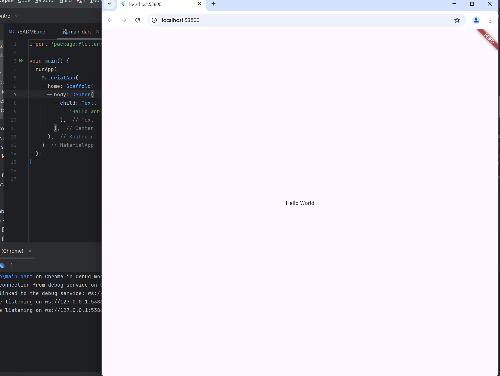
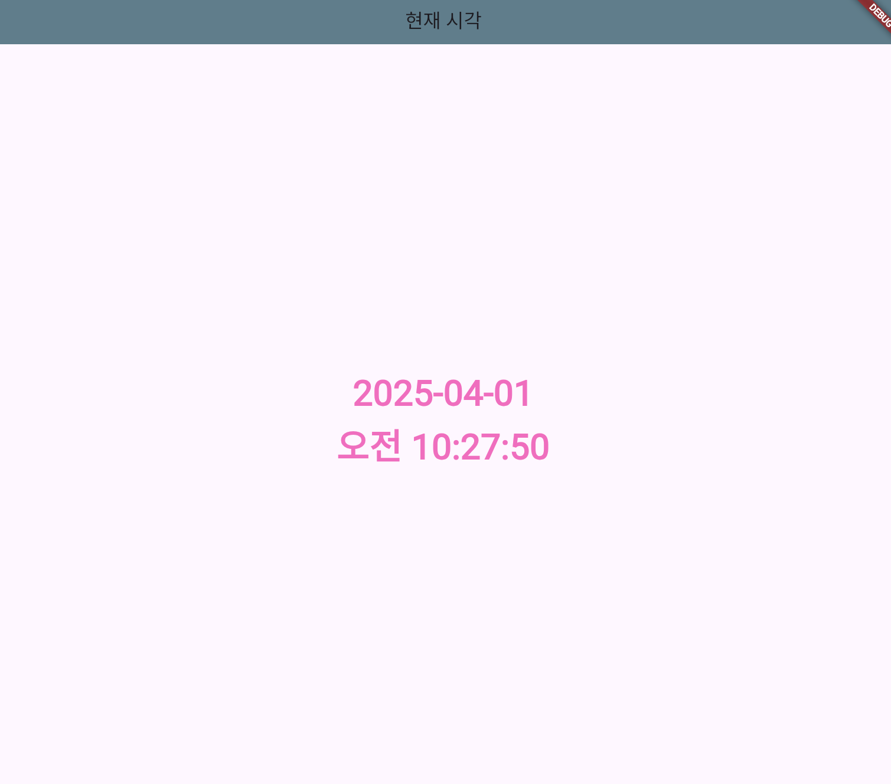
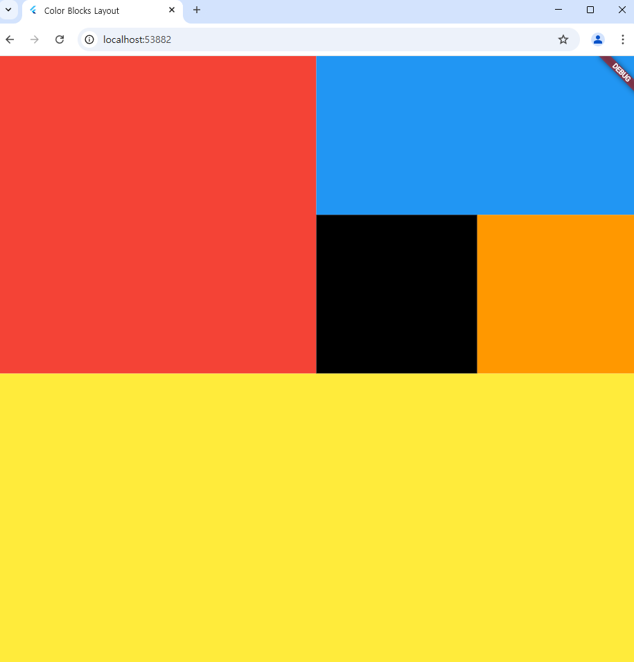
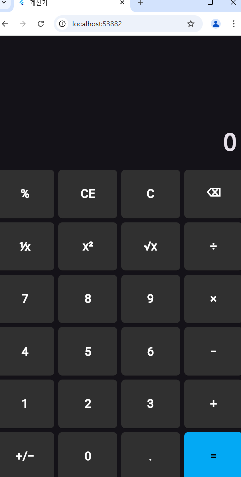

# 🤓Today I Learned!🤓

# 1주차 - Flutter 설치 및 구동

다음은 Flutter로 간단한 "Hello World"를 출력하는 코드입니다.    

### 📖코드

[😊 Hello World 코드 보기](app/1week/hello.dart)

### 🖥️결과
</img>
[실행결과 이미지](app/hello.png)

# 2주차 - Dart개념 및 실습

Dart문법 학습하기 <br>
[실습문제 풀어보기](https://docs.google.com/presentation/d/1aXllAnu3ZwwrJS9AMnVU6ud_vTI0keaCIOBQn-QEM64/edit#slide=id.g3335d87db6b_0_143)

### 📖실습문제1 - 구구단

[✏️구구단 코드 보기](app/2week/ex1.dart)

### 📖실습문제2 - 사각형

[🟦사각형 코드 보기](app/2week/ex2.dart)

### 📖실습문제3 - 요일출력

[📆요일출력 코드 보기](app/2week/ex3.dart)

# 3주차 -  Dart문법과 객체 

[🤓Dart강의자료](https://docs.google.com/presentation/d/1oYM2Qn0lEdFe5TLlpiKle7p_ecdEVhmuH4kYWWJqmwQ/edit?usp=sharing)

```
⭐객체 : 식별 가능한 대상 [상태=값(필드)/ 행위=기능(메서드)]

⭐클래스 : 객체의 설계도, 설계도에 의해 만들어진 형태를 객체

⭐객체지향 : 문제를 풀때 문제를 구성하고 있는 대상을 객체화 하는것
   Tip)객체와 인스턴스는 동일한 의미

접근 지정자: 필드명에 _(언더바) 를 붙이면 외부에서 접근 x

생성자: 클래스의 정보를 가지고 객체를 만들어줌
    - 기본 생성자 ( 인자 x ) 
    - 생성자 ( 인자 o )

getter - 외부에서 수정이 불가하게 
setter

상속 : 부모 클래스의 상태와 행위를 자식 클래스에 물려주는것
    -장점: 코드가 간결해진다(재사용성)
    -단점: 역사가 생김(히스토리)

인터페이스 : (상속의 단점 보완)
    -장점: 메소드만 잘 지키면 쉽게 사용 o
    -단점: 상하 관계가 없어서 매번 구현을 해줘야 함 (-> 단점 보완으로 믹스인)

추상 클래스: 메소드를 구현하지 않고 클래스에게 선언만 함

믹스인: 키워드로 다른 클래스의 기능을 빌려옴
```

### 📖실습하기1

[🐵이름, 나이 출력하기1](app/3week/ex4-1.dart) / [🐵이름, 나이 출력하기2](app/3week/ex4-2.dart) / [🐵이름, 나이 출력하기3](app/3week/ex4-3.dart)

### 📖실습하기2

[🟦사각형 출력하기](app/3week/ex4-4.dart) / [😶영웅 출력하기](app/3week/ex4-5.dart) / [🧌고블린 출력하기](app/3week/ex4-6.dart)

### 📖실습하기3

[🟦사각형 출력하기](app/3week/ex4-4.dart) / [😶영웅 출력하기](app/3week/ex4-5.dart)

# 4주차 - Flutter 실습

[🤓Flutter강의자료](https://docs.google.com/presentation/d/1_WUdaH1mP_ObZ_TiMxCTeB7aNkddJ1uiRHBE0V8nqVY/edit?slide=id.g33b3206563d_0_69#slide=id.g33b3206563d_0_69)

### 📖실습결과

[⏰현재시각 표시 코드 보기](app/4week/ex5-1.dart) 

</img> 
[현재시각 표시 사진](app/w4.png)

# 5주차 - Flutter 기본위젯

[🤓기본위젯 강의자료](https://docs.google.com/presentation/d/1NTg7YTuYcBfrvfmma_iyej33VDIkc9UaljrMkI6OZfY/edit?slide=id.p#slide=id.p)

### 📖실습결과1

[✌️화면 표시 코드 보기](app/5week/ex5-2.dart) 

</img>

### 📖실습결과2

[🪄계산기 표시 코드 보기](app/5week/ex5-3.dart) 

</img>

# 6주차 - Flutter 기본위젯

[🤓기본위젯2 강의자료](https://docs.google.com/presentation/d/1P0z6OBXCOrCf1gqjarCdBDcXrrYMJIVWJq8ePzyBXPk/edit?usp=sharing)

### 📘 위젯 라이프사이클 및 화면 전환 요약 (p.203 ~ 208)
---

### 🧩 1. 화면 전환 구조: Stack 기반

Flutter는 화면 전환 시 **Stack 구조**로 동작함.

- `push()` → 새 화면을 Stack 위에 쌓음
- `pop()` → 현재 화면을 Stack에서 제거 후 이전 화면으로 돌아감

### 📌 화면 흐름 예시

1. 앱 실행  
   → `FirstPage`의 `initState()` → `build()` 호출

2. `push()`로 `SecondPage`로 이동  
   → `SecondPage`의 `initState()` → `build()` 호출  
   → `FirstPage`의 `build()`도 다시 호출됨 (백그라운드 전환)

3. `pop()`으로 돌아옴  
   → `FirstPage`의 `build()` 호출  
   → `SecondPage`의 `dispose()` 호출

4. 앱 종료  
   → `FirstPage`의 `dispose()` 호출

---

## ⚙️ 2. 위젯 생명주기 메서드 정리

| 메서드         | 호출 시점                         | 설명 |
|----------------|----------------------------------|------|
| `initState()`  | 위젯이 처음 생성될 때 1회 호출     | 초기 설정, 네트워크 요청 등 |
| `build()`      | 위젯이 다시 그려질 때마다 호출     | UI 구성, 가벼운 처리만 가능 |
| `dispose()`    | 위젯이 완전히 제거될 때 호출       | 리소스 해제 및 정리용 |

> `build()`는 반복 호출되므로 복잡한 로직은 `initState()`에 작성해야 함

---

## 🚀 3. `push()` / `pop()` 메서드 개요

- `Navigator.push()`  
  → 새 페이지로 이동, `Future` 타입 반환 (비동기)

- `Navigator.pop()`  
  → 현재 페이지 제거 후 이전 페이지로 이동  
  → 두 번째 인자로 이전 페이지에 데이터 전달 가능

```dart
Navigator.push(
  context,
  MaterialPageRoute(builder: (context) => SecondPage())
);
```

```dart
Navigator.pop(context, "ok");
```

---

## 🧪 4. 로그 예시 출력 흐름

```text
// FirstPage 표시
I/flutter: FirstPage initState()
I/flutter: FirstPage build()

// SecondPage push
I/flutter: SecondPage initState()
I/flutter: SecondPage build()
I/flutter: FirstPage build()

// SecondPage pop (FirstPage로 돌아감)
I/flutter: FirstPage build()
I/flutter: SecondPage dispose()

// 앱 종료
I/flutter: FirstPage dispose()
```

---

## 📝 5. 마무리 요약

- `StatefulWidget` 클래스에서는 상태 변화에 따라 `build()`가 자주 호출되므로 UI그리기 전용메소드로만 사용해야합니다.
- **시간이 오래걸리거나 무거운 작업** `initState()`에서,  
  **리소스 정리**는 `dispose()`에서 처리합니다.
- 화면 전환은 `Navigator`의 `push()`와 `pop()`을 통해 Stack 구조로 이루어집니다.

# 7주차 -   
---


